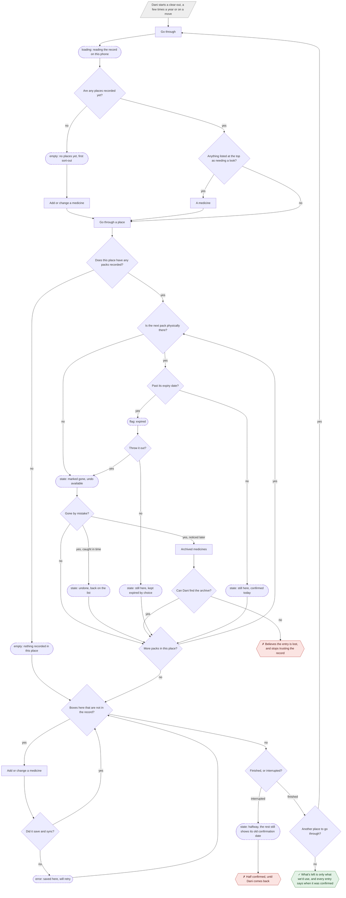
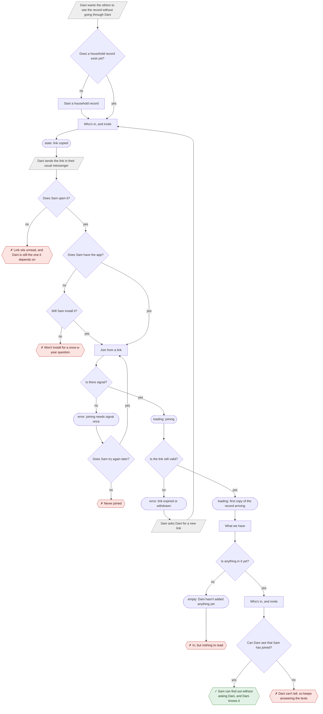

# User flows

**Status:** draft, 1 Oct 2026. There are four flows. Each is named after a job in
[jtbd.md](../research/jtbd.md), and each uses only screens from
[sitemap.md](./sitemap.md#screens). Two screens were added to the sitemap
while drawing them: *Go through* and *Archived medicines*. Both are tagged
there.

| Flow | Job | Persona |
|---|---|---|
| [1](#1--main-job-find-out-what-we-have-and-whether-its-still-good) | **Main job**: find out what we have and whether it's still good | P2 Sam |
| [2](#2--l2-recovering-what-we-got-it-for) | **L2**: recovering what we got it for | P1 Dani |
| [3](#3--l1--e1-clearing-out-whats-no-longer-any-good) | **L1 + E1**: clearing out what's no longer any good, and keeping the record true | P1 Dani |
| [4](#4--s1-not-being-the-one-it-all-depends-on) | **S1**: not being the one it all depends on | P1 Dani → P2 Sam |

**Legend**

| Shape | Meaning |
|---|---|
| `["…"]` rectangle | a screen from sitemap.md |
| `{"…?"}` diamond | a decision |
| `(["…"])` stadium, dashed | a state of the screen before it: empty, error, loading, flagged |
| `[/"…"/]` parallelogram, grey | something that happens outside the app, at the drawer or on the phone |
| `{{"✓ …"}}` green hexagon | success: the job is done |
| `{{"✗ …"}}` red hexagon | dead end: the person is stuck, or leaves with a wrong answer |

**Two rules shape every flow.**
- **Loading is almost never a wait.** The record is read from the phone
  ([CLAUDE.md §9](../CLAUDE.md#9-architecture-sketch)). The only real
  waits are for things that have to reach the server: joining, and syncing.
- **No flow ends on the app telling someone what to take**
  ([CLAUDE.md, "Deliberately never"](../CLAUDE.md#deliberately-never)). Success
  means the person knows what the household has and what it wrote. The
  decision stays theirs.

---

## 1 · Main job: find out what we have and whether it's still good

> *When someone at home needs medicine and the person who knows isn't there, I
> want to find out what we have and whether it's still good, so that I don't have
> to guess.* ([jtbd](../research/jtbd.md#the-main-job))

**Sam**, at home without Dani, possibly at night and unwell
([H1](../research/jtbd.md#h1)). Navigation depth: 1–3 taps
([sitemap, Depth](./sitemap.md#depth-taps-to-the-job)).

```mermaid
flowchart TD
    START[/"Sam needs something, and Dani isn't there"/]
    START --> JOINED{"Is Sam already in the household record?"}
    JOINED -->|no| HASLINK{"Is there an invite link Sam can find?"}
    HASLINK -->|no| X_TEXT{{"✗ Texts Dani and waits, or guesses"}}
    HASLINK -->|yes| FLOW4["Join from a link"]
    FLOW4 --> HOME
    JOINED -->|yes| HOME["What we have"]

    HOME --> S_LOAD(["loading: reading the record on this phone"])
    S_LOAD --> ANY{"Has anything been added yet?"}
    ANY -->|no| S_EMPTY(["empty: nothing recorded yet"])
    S_EMPTY --> X_EMPTY{{"✗ Back to the drawer, guessing"}}
    ANY -->|yes| S_SYNC{"Did the last sync work?"}
    S_SYNC -->|no| S_ERR(["error: could not sync, showing this phone's copy from the date it was last updated"])
    S_ERR --> SEE
    S_SYNC -->|yes| SEE{"Can Sam spot it in the list?"}

    SEE -->|yes| MED["A medicine"]
    SEE -->|no| KNOWNAME{"Does Sam know what it's called?"}
    KNOWNAME -->|yes| BYNAME["Find by name"]
    KNOWNAME -->|no| BYPURPOSE["Find by what it's for"]

    BYNAME --> NAMEHIT{"Any match?"}
    NAMEHIT -->|yes| MED
    NAMEHIT -->|no| S_NONAME(["empty: nothing recorded under that word"])
    S_NONAME --> TRYPURPOSE{"Try by what it's for instead?"}
    TRYPURPOSE -->|yes| BYPURPOSE
    TRYPURPOSE -->|no| X_NONE{{"✗ Concludes we have none, which may be wrong"}}

    BYPURPOSE --> FITS{"Is anything tagged to that purpose?"}
    FITS -->|yes| MED
    FITS -->|no| S_NOPURPOSE(["empty: nothing in the record is tagged for this"])
    S_NOPURPOSE --> X_NOTAG{{"✗ Still has to decide alone"}}

    MED --> EXPIRED{"Is it past its expiry date?"}
    EXPIRED -->|yes| S_EXPIRED(["flag: expired on the printed date"])
    S_EXPIRED --> OK_NOTGOOD{{"✓ Knows not to rely on this one"}}
    EXPIRED -->|no| STALE{"Confirmed by someone recently?"}
    STALE -->|no| S_STALE(["flag: not confirmed since a past date"])
    S_STALE --> DRAWER[/"Sam checks the drawer"/]
    DRAWER --> THERE{"Is the box there?"}
    THERE -->|no| GONE["A medicine"]
    GONE --> X_GONE{{"✗ Marks it gone, and has nothing for the need"}}
    THERE -->|yes| NOTE
    STALE -->|yes| NOTE{"Has anyone written what it's for?"}
    NOTE -->|no| S_UNKNOWN(["flag: purpose unknown"])
    S_UNKNOWN --> X_UNKNOWN{{"✗ Has the box but not its purpose, must reach Dani"}}
    NOTE -->|yes| MATCH{"Does what the household wrote match the need?"}
    MATCH -->|no| HOME
    MATCH -->|yes| OK_FOUND{{"✓ Knows what we have, what we wrote it is for, and that it's still good, without Dani"}}

    classDef state stroke-dasharray: 5 4
    classDef off fill:#eeeeee,stroke:#888888,color:#333333
    classDef ok fill:#e3f2e6,stroke:#2e7d32,color:#123d17
    classDef stuck fill:#fbe4e2,stroke:#b3261e,color:#4f1310
    class S_LOAD,S_EMPTY,S_ERR,S_NONAME,S_NOPURPOSE,S_EXPIRED,S_STALE,S_UNKNOWN state
    class START,DRAWER off
    class OK_NOTGOOD,OK_FOUND ok
    class X_TEXT,X_EMPTY,X_NONE,X_NOTAG,X_GONE,X_UNKNOWN stuck
```

**Decisions**
1. *Is Sam already in the household record?* If not, can Sam find the
   invite link? This is the [S1](#4--s1-not-being-the-one-it-all-depends-on) dependency. `[?]` Whether Sam
   ever joins at all is open ([sitemap, open question 3](./sitemap.md#open-questions-this-inventory-raises)).
2. *Has anything been added yet?* This depends entirely on Dani having done
   flows 2–3.
3. *Did the last sync work?* A sync failure does not block reading.
4. *Can Sam spot it in the list?* This is the 1-tap path.
5. *Does Sam know what it's called?* This is the [H3](../research/jtbd.md#h3)
   branch point. `[?]` Nobody has asked Sam.
6. *Any match?* / *Try by what it's for instead?*
7. *Is anything tagged to that purpose?*
8. *Is it past its expiry date?* This is a date comparison, nothing more.
9. *Confirmed by someone recently?* This is [E1](../research/jtbd.md#e1). The
   threshold is `[?]`, a year in [M1](../research/research.md#three-mechanics-for-the-mvp).
10. *Is the box there?* Sam's own look at the drawer settles it.
11. *Has anyone written what it's for?* This is [L2](../research/jtbd.md#l2)'s gap.
12. *Does what the household wrote match the need?* **This is Sam's judgement,
    never the app's.**

**States**
- **loading**: reading the record on this phone. It should be instant, and it
  never waits on the network.
- **empty**: three different empties, each with different wording:
  - *nothing recorded yet*: the record is new
  - *nothing recorded under that word*: this must not read as *"we don't own
    any"* ([§3, Ledger](../research/research.md#3-patterns))
  - *nothing in the record is tagged for this*: this must not read as *"you
    can't treat this"* ([§3](../research/research.md#selected-need-first))
- **error**: could not sync. The phone's copy is shown, with the date it was
  last updated. That date is the honest part.
- **flags** (states of *A medicine*): *expired*, *not confirmed since…*,
  *purpose unknown*.

**Endpoints**
- ✓ *Knows what we have, what we wrote it is for, and that it's still good,
  without Dani*. This is the main job done.
- ✓ *Knows not to rely on this one* (expired). Still a success: the job is
  *"so that I don't have to guess"*, and Sam didn't.
- ✗ *Texts Dani and waits, or guesses*: never joined. This is the pain S1 exists for.
- ✗ *Back to the drawer, guessing*: an empty record.
- ✗ *Concludes we have none, which may be wrong*: the most dangerous dead end.
  The wording of the empty state is all that stands against it.
- ✗ *Still has to decide alone*: nothing is tagged for the need.
- ✗ *Marks it gone, and has nothing for the need*: the record was out of date. At
  least Sam's tap now fixes it for the next person.
- ✗ *Has the box but not its purpose*: the L2 gap, felt by the person it hurts
  most.

---

## 2 · L2: recovering what we got it for

> *When I find something and can't remember what we got it for, I want to know
> whether it's any use to us, so that I can use it or throw it out instead of
> leaving it there again.* ([jtbd](../research/jtbd.md#l2))

**Dani**, holding a box. It ends in one of two outcomes the job names: *use it*,
or *throw it out*. *Leaving it there again* is the dead end.

```mermaid
flowchart TD
    START[/"Dani finds a box and can't remember what it was for"/]
    START --> ENTRY{"Where does Dani start?"}
    ENTRY -->|"from the clear-out"| GT["Go through"]
    ENTRY -->|"from the box in hand"| HOME["What we have"]

    GT --> LISTED{"Is it in the top section as purpose unknown?"}
    LISTED -->|yes| MED["A medicine"]
    LISTED -->|no| HOME

    HOME --> BYNAME["Find by name"]
    BYNAME --> HIT{"Any match?"}
    HIT -->|yes| MED
    HIT -->|no| S_NONE(["empty: not in the record"])
    S_NONE --> ADD["Add or change a medicine"]
    ADD --> S_SAME(["state: a medicine with this name already exists"])
    S_SAME --> SAMEQ{"Is it the same medicine?"}
    SAMEQ -->|yes| MED
    SAMEQ -->|no| MED

    MED --> HASNOTE{"Has anyone written what it's for?"}
    HASNOTE -->|yes| WHO["A medicine"]
    WHO --> AGREE{"Does Dani agree with what is written, and who wrote it?"}
    AGREE -->|yes| USE{"Any use to us now?"}
    AGREE -->|no| WRITE
    HASNOTE -->|no| S_UNKNOWN(["flag: purpose unknown, note field open"])
    S_UNKNOWN --> REMEMBER{"Does Dani remember now?"}
    REMEMBER -->|yes| WRITE["A medicine"]
    REMEMBER -->|no| ASK[/"Dani asks someone at home"/]
    ASK --> KNOWS{"Does anyone know?"}
    KNOWS -->|yes| WRITE
    KNOWS -->|no| KEEP{"Keep it anyway?"}
    KEEP -->|yes| X_SHELF{{"✗ Back on the shelf, still unknown"}}
    KEEP -->|no| BIN

    WRITE --> S_SAVE(["loading: saved on this phone, syncing"])
    S_SAVE --> SYNCED{"Did it sync?"}
    SYNCED -->|no| S_ERR(["error: saved here, will retry when there is signal"])
    S_ERR --> USE
    SYNCED -->|yes| USE

    USE -->|yes| OK_USE{{"✓ Use it: the note is there, with Dani's name and date"}}
    USE -->|no| BIN["A medicine"]
    BIN --> S_UNDO(["state: marked gone, undo available"])
    S_UNDO --> OK_BIN{{"✓ Throw it out: archived, out of the cupboard and the list"}}

    classDef state stroke-dasharray: 5 4
    classDef off fill:#eeeeee,stroke:#888888,color:#333333
    classDef ok fill:#e3f2e6,stroke:#2e7d32,color:#123d17
    classDef stuck fill:#fbe4e2,stroke:#b3261e,color:#4f1310
    class S_NONE,S_SAME,S_UNKNOWN,S_SAVE,S_ERR,S_UNDO state
    class START,ASK off
    class OK_USE,OK_BIN ok
    class X_SHELF stuck
```

*A medicine* appears several times (`MED`, `WHO`, `WRITE`, `BIN`). It is one
screen in different states. The note is written **on** it, in place, which is
the change [Navigation](./sitemap.md#depth-taps-to-the-job) made to keep L2 at
3 taps.

**Decisions**
1. *Where does Dani start?* From *Go through*'s top section, or from the box in
   hand.
2. *Is it in the top section as purpose unknown?*
3. *Any match?* If not, the box isn't in the record yet, and the capture
   happens here, as a by-product ([jtbd costs](../research/jtbd.md#costs-requirements-and-promises)).
4. *Is it the same medicine?* If yes, it's another Pack of an existing
   Medicine. If no, it's a new Medicine. Both continue to *A medicine*. `[?]`
   This depends on the Medicine/Pack split ([sitemap, Entities §6](./sitemap.md#6-pack-)).
5. *Has anyone written what it's for?*
6. *Does Dani agree with what is written, and who wrote it?* This is
   [E2](../research/jtbd.md#e2) seen from the Keeper's side.
7. *Does Dani remember now?* / *Does anyone know?* The only help is a person.
   **The app never fills the purpose in from the ingredient**
   ([CLAUDE.md §7.1](../CLAUDE.md#7-product-principles)).
8. *Did it sync?*
9. *Any use to us now?* / *Keep it anyway?*

**States**
- **empty**: not in the record.
- **state**: a medicine with this name already exists. This is the duplicate
  warning reviewers asked for by name
  ([personas P1](../research/personas.md#trust-triggers--what-earns-it-what-loses-it)).
- **flag**: purpose unknown, with the note field already open.
- **loading**: saved on this phone, syncing. It never blocks the next step.
- **error**: saved here, will retry. Nothing is lost
  ([requirement](../research/jtbd.md#costs-requirements-and-promises)).
- **state**: marked gone, undo available.

**Endpoints**
- ✓ *Use it*: the note exists, with Dani's name and date, for Sam next time.
- ✓ *Throw it out*: archived, not deleted.
- ✗ *Back on the shelf, still unknown*: exactly the failure L2 names. It
  stays flagged, so it comes back on *Go through* next time. The flag is the
  only thing that stops it being forgotten again.

---

## 3 · L1 + E1: clearing out what's no longer any good

> *When I'm going through the cupboard, I want to see what's no longer any good
> or no longer there, so that what's left is only what we'd actually use.*
> ([L1](../research/jtbd.md#l1)) — and, done along the way, *relying on our own
> record without second-guessing it* ([E1](../research/jtbd.md#e1)).

**Dani**, two or three times a year, or during a house move
([§6.6–6.7](../research/research.md#66-cabinets-accumulate--they-are-not-assembled)).

**Decisions**
1. *Are any places recorded yet?* If not, this is the first sort-out, and
   capture happens inside the clear-out
   ([jtbd costs](../research/jtbd.md#costs-requirements-and-promises)).
2. *Anything listed at the top as needing a look?* This is the folded
   *Needs a look* ([Navigation](./sitemap.md#depth-taps-to-the-job)).
3. *Does this place have any packs recorded?*
4. *Is the next pack physically there?* This is the
   [M1](../research/research.md#three-mechanics-for-the-mvp) gesture. One tap
   either way.
5. *Gone by mistake?* There are three answers. **The deepest risk in the flow
   is the third.**
6. *Can Dani find the archive?*
7. *Past its expiry date?* / *Throw it out?* **Dani decides.** Some households
   treat expiry as a rule and some as a myth
   ([§6.7](../research/research.md#67-how-often-and-what-people-do-about-expiry)).
   The app shows the date and does not insist.
8. *More packs in this place?*
9. *Boxes here that are not in the record?*
10. *Did it save and sync?*
11. *Finished, or interrupted?* / *Another place to go through?*

**States**
- **loading**: reading the record on this phone.
- **empty**: two kinds:
  - *no places yet*: day one, or a household that has never done a clear-out
  - *nothing recorded in this place*: either a new place, or the record is
    missing everything in it
- **error**: saved here, will retry.
- **state**: three outcomes for a pack:
  - *marked gone, undo available*
  - *undone*
  - *still here, confirmed today*
- **state**: *still here, kept expired by choice*. The record shows that Dani
  kept it knowingly. It doesn't nag about it again.
- **flag**: *expired*.
- **state**: *halfway*. The rest still shows its old confirmation date, which is
  honest, not broken.

**Endpoints**
- ✓ *What's left is only what we'd use, and every entry says when it was
  confirmed.* Both L1 and E1 are done in one pass, the way
  [jtbd's conclusions](../research/jtbd.md#2-e1--relying-on-our-own-record-without-second-guessing-it)
  said one gesture could.
- ✗ *Believes the entry is lost, and stops trusting the record*: a missed undo,
  plus an archive Dani can't find. This is the *"makes the whole app
  untrustworthy"* failure ([E1](../research/jtbd.md#e1)). *Archived medicines*
  is in the sitemap because of this endpoint.
- ✗ *Half confirmed*: not a lie, but the record is only as fresh as the
  part Dani reached.

---

## 4 · S1: not being the one it all depends on

> *When I'm away and someone at home texts me asking which one to take, I want
> them to work it out without me, so that nothing waits on my answering.*
> ([jtbd](../research/jtbd.md#s1))

**Dani** sets it up, and **Sam** joins. This is the only flow where both personas
act, and it is the route by which flow 1 can happen at all.

**Decisions**
1. *Does a household record exist yet?*
2. *Does Sam open it?*
3. *Does Sam have the app?* / *Will Sam install it?* `[?]` This is the
   personas' unverified pain point: *"they won't install an app for a question
   they have once a year"* ([P2](../research/personas.md#pain-points---every-one)).
   If it holds, a no-install reading path becomes load-bearing. That path is
   currently the [ORPHAN](./sitemap.md#screens) *Emergency view*, or
   something like it.
4. *Is there signal?* Joining is the **one** step in the product that cannot
   be done offline.
5. *Does Sam try again later?*
6. *Is the link still valid?* `[?]` Expiry and withdrawal are undecided
   ([CLAUDE.md §11](../CLAUDE.md#11-open-questions)).
7. *Is anything in it yet?*
8. *Can Dani see that Sam has joined?* This is why *Who's in* shows who has
   used the link. S1's outcome is Dani's, so Dani has to be able to see it.

**States**
- **state**: link copied.
- **loading**: joining, and then the first copy of the record arriving. These
  are the two real waits in the product.
- **error**: joining needs signal once, and the link has expired or been
  withdrawn `[?]`.
- **empty**: Dani hasn't added anything yet.

**Endpoints**
- ✓ *Sam can find out without asking Dani, and Dani knows it.*
- ✗ *Link sits unread*: outside the app's reach.
- ✗ *Won't install for a once-a-year question*: `[?]`, and the most
  consequential guess in this flow.
- ✗ *Never joined*: no signal, and no second try.
- ✗ *In, but nothing to read*: S1 succeeded on paper, and Sam's moment will
  still fail. Flow 4 depends on flows 2–3.
- ✗ *Dani can't tell, so keeps answering the texts*: the record works, but
  Dani doesn't know it does.

---

## What the four flows say together

- **Every route to the main job's success runs through Dani's work first.**
  Flow 1 succeeds only if flows 2, 3 and 4 have happened. That is the
  *"dependency, not a peer"* point in
  [personas](../research/personas.md#why-dani-is-primary-and-sam-and-robin-secondary),
  drawn out.
- **The dead ends cluster in Sam's flows, and they are wording problems before
  they are structure problems.** *Concludes we have none* and *still has to
  decide alone* are empty states. Their copy is the safety surface
  ([CLAUDE.md §8](../CLAUDE.md#8-safety-privacy-and-legal-posture)).
- **The two `[?]`s with the most at stake:** whether Sam has the brand name
  (flow 1, decision 5: [H3](../research/jtbd.md#h3)), and whether Sam will
  install anything (flow 4, decision 3). Both are questions for the same
  five conversations.
