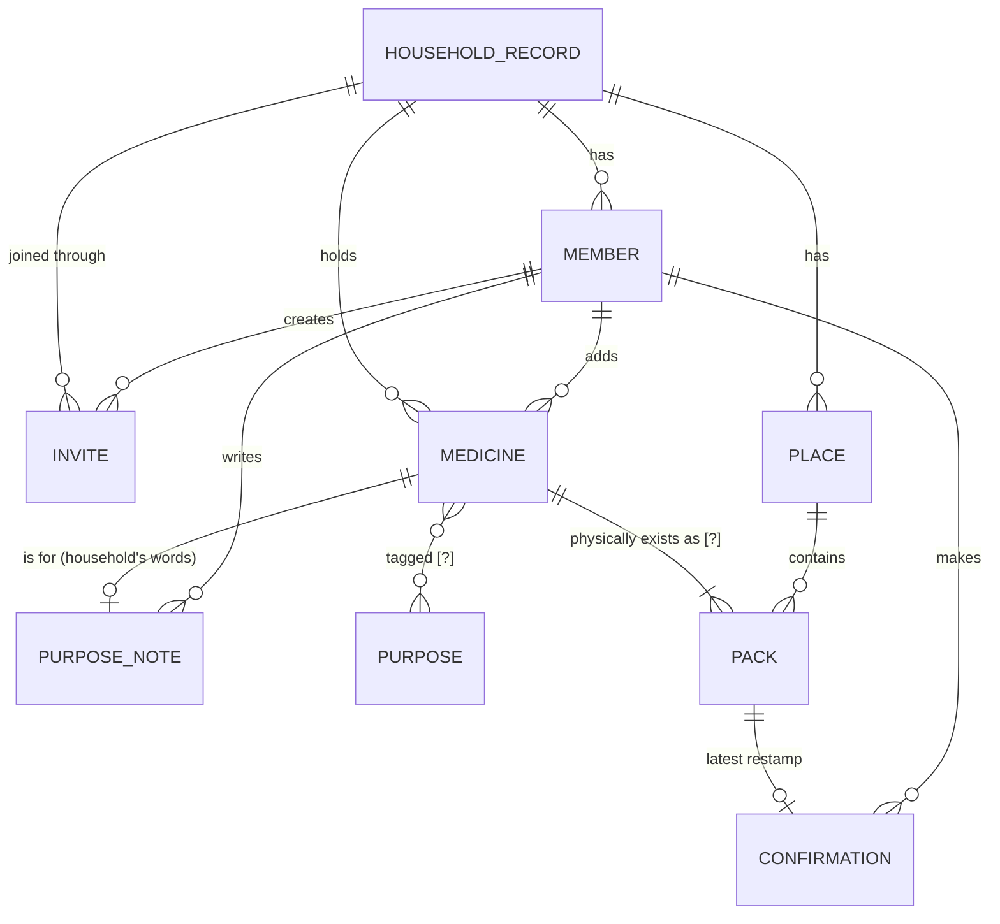

# Sitemap

**Status:** draft, 1 Oct 2026. [Entities](#entities), then a first pass at
[Screens](#screens), kept shallow on purpose, then [Navigation](#navigation). Built from [jtbd.md](../research/jtbd.md),
[personas.md](../research/personas.md) and
[research.md](../research/research.md). Locked decisions in the brief are
quoted only where a job needs them.

**How to read it**
- An entity is in the **main list** only if a job in jtbd.md needs it. The jobs
  that count are the main job, [L1](../research/jtbd.md#l1)–[L3](../research/jtbd.md#l3),
  [E1](../research/jtbd.md#e1), [E2](../research/jtbd.md#e2),
  [S1](../research/jtbd.md#s1), and the two hypotheses carried into IA,
  [H3](../research/jtbd.md#h3) and [H4](../research/jtbd.md#h4).
- Anything that serves only a **parked** hypothesis, or no job at all, goes to
  [Questionable](#questionable). That includes things the brief has locked. Where
  that happens, it says so.
- **`[?]`** means I'm hypothesising: the object or field follows from a job, but
  nothing evidences this exact shape. Each one says what would settle it.

---

## Entities

### 1. Household record

The one shared thing that every member reads and writes. The brief calls it
*the cabinet* ([CLAUDE.md §6.3](../CLAUDE.md)). Here it is named for what it is,
because it is not one cupboard ([L3](../research/jtbd.md#l3)).

| | |
|---|---|
| **Comprises** | Members · Places · Medicines · Invites. Nothing else is stored at this level. |
| **Job** | **[Main job](../research/jtbd.md#the-main-job):** the knowledge has to exist somewhere that isn't one person's head. **[S1](../research/jtbd.md#s1):** *"a medicine database held by only one person in the home makes no sense"* `[B]`. **[E2](../research/jtbd.md#e2):** *one record both people read*. |
| **Relationships** | Has many **Members**, **Places** and **Medicines**. Is joined through **Invites**. One per household (more than one cabinet per user is not in v1, [CLAUDE.md §6](../CLAUDE.md)). |
| **Constraints from the jobs** | No cap on the number of medicines ([promise](../research/jtbd.md#costs-requirements-and-promises)). It must survive a lost phone ([requirement](../research/jtbd.md#costs-requirements-and-promises)). It must stay usable after months of nobody touching it: use runs 1–5 times a year ([§6.7](../research/research.md#67-how-often-and-what-people-do-about-expiry)). |

### 2. Member

A person in the household, as the record knows them.

| | |
|---|---|
| **Comprises** | **Name**, as the household uses it. **Joined or not** `[?]`: whether this person has opened the record themselves, or exists only as a name someone else entered. |
| **Job** | **[E2](../research/jtbd.md#e2):** trust depends on *"whose words they are and when"*, so every written thing needs an author. **[S1](../research/jtbd.md#s1):** the second person needs their own way in. **[Main job](../research/jtbd.md#the-main-job):** Sam is a member. |
| **Relationships** | Belongs to one **Household record**. Is the author of **Medicines**, **Purpose notes** and **Confirmations**. May have redeemed an **Invite**. |
| **`[?]`** | *Joined or not* is open. Sam *"may never install anything"* ([personas P2](../research/personas.md#p2--sam-the-other-person--secondary)). If Sam only ever reads, a Member might never author anything, and E2 would still work. Settled by: the five conversations ([jtbd](../research/jtbd.md#what-this-matrix-says-back-to-the-brief)). |
| **Not here** | Allergies and chronic conditions. See [Questionable](#questionable). No job on the table reads them. |

### 3. Invite

How the second person gets in without going through the first.

| | |
|---|---|
| **Comprises** | **Link**. **Created by** (Member). **Created at**. **Expiry / revoked** `[?]`: open in [CLAUDE.md §11](../CLAUDE.md). |
| **Job** | **[S1](../research/jtbd.md#s1):** *"Invite by link, no account wall; readable by someone who never installed anything"* (matrix FUNCTION cell). Dani wants the others *"to see it without going through them"* ([personas P1, job 4](../research/personas.md#jobs--what-they-are-trying-to-do)). |
| **Relationships** | Belongs to one **Household record**. Created by a **Member**. Redeemed by a person who then becomes a **Member** (or reads without becoming one `[?]`, as above). |

### 4. Place

Somewhere in the home, or outside it, where medicine is kept.

| | |
|---|---|
| **Comprises** | **Name**, in the household's words (*kitchen drawer*, *bathroom*, *the car*, *"Drawer of Shit in the spare room"*). The **Packs** it holds. |
| **Job** | **[L3](../research/jtbd.md#l3):** *"it could be in three different places"*. `[B]` Mumsnet posters keep it in two or three places at once ([§6.4](../research/research.md#64-medicine-is-scattered-and-one-person-knows-where)). `[O]` Kitchen 67%, bedroom 25%, bathroom 14% in Finland; cars and handbags in the meta-analysis ([§5.13](../research/research.md#513-where-people-keep-them)). |
| **Relationships** | Belongs to one **Household record**. Holds many **Packs**. |
| **Note** | Place is here for **finding**, not for heat. A heat attribute on a Place serves only [H5](../research/jtbd.md#h5), which is parked. See [Questionable](#questionable). |

### 5. Medicine

The thing as the household knows it: *Panadol*, *the Calpol*, *the throat
spray*. This is what is identified and what has a purpose.

| | |
|---|---|
| **Comprises** | **Name, as the household calls it.** The only field that is ever required ([CLAUDE.md §7.2](../CLAUDE.md)). In practice it is a brand: *brand-literate, ingredient-blind* ([§5.6](../research/research.md#56-what-this-changes)). **Purpose note** (entity 7). **Purposes** `[?]` (entity 8). **Added by**, **added at**. **Archived or current**: archive rather than delete. *"Archive rather than delete"* is asked for by name ([personas P1, trust triggers](../research/personas.md#trust-triggers--what-earns-it-what-loses-it)). |
| **Job** | **[L2](../research/jtbd.md#l2):** the thing a purpose is attached to. `[O]` In ~30% of 48 Belgian homes, nobody knew a stored medicine's indication ([§6.1](../research/research.md#61-someone-opened-48-real-medicine-cabinets)). **[L3](../research/jtbd.md#l3):** the thing you ask *"do we even have it"* about. **[Main job](../research/jtbd.md#the-main-job):** *"what we have"*. |
| **Relationships** | Belongs to one **Household record**. Has one or more **Packs** `[?]`. Has a **Purpose note**. Tagged with zero or more **Purposes** `[?]`. Added by a **Member**. |
| **A state the jobs need** | **Purpose unknown.** A Medicine with no Purpose note is valid, and it should say so on its face, not hide it. That is L2's starting condition: *"I find something and can't remember what we got it for"*. Its outcome, *"use it or throw it out instead of leaving it there again"*, means *unknown* has to be visible. |

### 6. Pack `[?]`

One physical box, bottle or strip of a Medicine, in one Place.

| | |
|---|---|
| **Comprises** | **Place**. **Expiry date**. **Here / gone**. **Last confirmed by**, **last confirmed at** (entity 9). **Added by**, **added at**. **Quantity** `[?]`, only if [H4](../research/jtbd.md#h4) is decided for it. |
| **Job** | **[L1](../research/jtbd.md#l1):** *"no longer any good **or no longer there**"*. Both are true of a box, not of a brand. **[L3](../research/jtbd.md#l3):** *"wherever it is"*. One medicine can be in more than one place. **[Main job](../research/jtbd.md#the-main-job):** *"whether it's still good"*. **[E1](../research/jtbd.md#e1):** the entry that carries its own age. |
| **Relationships** | Belongs to one **Medicine**. Sits in one **Place**. Restamped by **Confirmations**. Carries **Flags**. |
| **Why `[?]`** | The brief models one entity, with expiry, quantity and location directly on the medicine ([CLAUDE.md §6.1](../CLAUDE.md)). Splitting it out is my inference from L1 + L3. It is not evidenced. Medicine is spread across rooms ([§6.4](../research/research.md#64-medicine-is-scattered-and-one-person-knows-where)), but **nothing shows the *same* medicine in two places at once**, and the *"fourth box"* is itself `[?]` in L3. **If the split is rejected,** Pack's fields fold into Medicine, and two boxes of Panadol become two Medicines, each with its own Purpose note. That duplicates the household's words, which is the cost to weigh. Settled by: one real cabinet. Count how many brands appear in more than one place. The author's household can answer this. |
| **Quantity `[?]`** | No carried-forward job needs a count. *Here / gone* covers L1 and L3. A count serves only [H4](../research/jtbd.md#h4), whose open question is exactly whether running low should be visible at all. Hold the field until H4 is decided. |

### 7. Purpose note

What the household decided the medicine is for, in their own words.

| | |
|---|---|
| **Comprises** | **Text**, free, never overwritten by reference data ([CLAUDE.md §7.1](../CLAUDE.md)). **Written by** (Member). **Written at**. |
| **Job** | **[L2](../research/jtbd.md#l2):** the job the product exists for. *"Nobody answers 'what did **we** decide this was for?'"* ([§1, difference 2](../research/research.md#three-differences--where-nobody-is-standing)). **[E2](../research/jtbd.md#e2):** author and date are how Sam can trust Dani's words without Dani. **[L3](../research/jtbd.md#l3):** *"L2's words are what you search"* ([jtbd conclusions](../research/jtbd.md#3-s1--not-being-the-one-it-all-depends-on)). |
| **Relationships** | Belongs to one **Medicine**. Written by one **Member**. |
| **`[?]`** | **One note or several.** The [coordination-vs-collaboration finding](../research/research.md#74-coordination-versus-collaboration--a-distinction-relevant-to-e2) suggests E2 wants more than one person able to add to what a medicine is for. Nobody has said so. Default to one note with its author shown. Revisit if Sam ever writes. |

### 8. Purpose `[?]`

A reason: *throat*, *fever*, *allergy*, *stomach*. Medicines are found through it.

| | |
|---|---|
| **Comprises** | **Label**. The Medicines tagged to it. |
| **Job** | **[H3](../research/jtbd.md#h3) (carried forward):** *"get to it by what it's for, so that not knowing the word doesn't stop me"*. Sam's job only. **[L3](../research/jtbd.md#l3):** the *form* its answer takes, per [jtbd, "browse by purpose"](../research/jtbd.md#closing-only-a-hypothesis-job--not-cut-but-unpaid-for). One household sorted medicines into six bags by ailment, *"a game-changer"* ([§6.5](../research/research.md#65-sorting-by-ailment-is-something-people-already-do)). |
| **Relationships** | Many-to-many with **Medicine**. Belongs to the **Household record**, or to bundled reference data. Which one is open, see below. |
| **Why `[?]`** | H3 is a hypothesis, and the whole entity rests on it. [research H4](../research/research.md#h4--pattern) calls it *"the weakest-supported major decision in the project"*. Also open: **whose labels?** If the household writes them, they stay true to *§7.1, the household's words win*, but a list of labels can drift. If they come from a curated list, the labels are consistent, but it starts to look like an authority. That is close to the line where it *"can read as advice"* ([§3](../research/research.md#selected-need-first)). This must be settled before IA locks, which is why H3 was carried forward. |

### 9. Confirmation

One person saying, at one moment, *still here* or *gone*.

| | |
|---|---|
| **Comprises** | **Answer**: still here / gone. **By** (Member). **At**. |
| **Job** | **[E1](../research/jtbd.md#e1):** *"an entry nobody has confirmed in a year says so on its face instead of pretending"* ([M1](../research/research.md#three-mechanics-for-the-mvp)). Without it, *"this job cannot be served, only claimed"*. **[L1](../research/jtbd.md#l1):** *gone* is the *"no longer there"* half. Nobody in the market does it ([matrix](../research/jtbd.md#the-matrix)). **[E2](../research/jtbd.md#e2):** *who* confirmed is provenance. |
| **Relationships** | Applies to one **Pack** (or to one Medicine, if Pack folds). Made by one **Member**. *Gone* sets the Pack to gone. If it was the last Pack, the Medicine is archived. |
| **Note** | Only the **latest** Confirmation is needed by E1. A full history is not asked for by any job. Keep the latest, and don't build a log. Trust comes from the object, *"never from consensus"* ([§2](../research/research.md#one-that-will-not-work-crowd-corroboration)). Two members confirming does not make a pack truer. |

### 10. Flag

A state the record shows about a Pack or Medicine. It is computed and never typed
in ([CLAUDE.md §9](../CLAUDE.md), `flags` is pure). Only the kinds a job needs
are listed here.

| Kind | Job | Computed from |
|---|---|---|
| **Expired / expiring soon** | [L1](../research/jtbd.md#l1) (*"no longer any good"*), [Main](../research/jtbd.md#the-main-job) (*"still good"*) | Pack expiry date |
| **Not confirmed in a long time** | [E1](../research/jtbd.md#e1) | Pack last-confirmed-at. The threshold is `[?]`, a year in M1 |
| **Purpose unknown** | [L2](../research/jtbd.md#l2) | Medicine with no Purpose note |
| **Running low** `[?]` | [H4](../research/jtbd.md#h4) (carried forward, undecided) | Pack quantity, if it exists |

**Relationships:** attaches to a **Pack** or a **Medicine**. Has no author.
**Constraint:** *never cry wolf* ([constraint](../research/jtbd.md#costs-requirements-and-promises)).
A Flag is shown where the thing already is. Whether it ever speaks unprompted
is a separate question (see Digest, below).

### How they connect



Flags are left out of the diagram. They are derived, not stored.

---

## Questionable

Each item below either serves only a **parked** hypothesis or serves no job at
all. Several are **locked in the brief** ([CLAUDE.md §5–6](../CLAUDE.md)). This
list conflicts with the brief on those, and that conflict is stated here, not
resolved. *Parked* means *set aside for this stage*, not *wrong*
([jtbd](../research/jtbd.md#hypotheses)).

### Entities

| Entity | Where it comes from | Why it's here, not above |
|---|---|---|
| **Dose log entry**: who, what, when (*why* already cut) | Locked, [§5, §6.4](../CLAUDE.md) | Serves only [H2](../research/jtbd.md#h2), which is parked. The hazard is well measured (`[O]` 45.6% would double-dose). Nobody has voiced the want. The brief's goal question 3, *"did someone already take it?"*, rests on this. |
| **Allergy** and **Chronic condition** (on Member) | Locked, [§5, §6.3](../CLAUDE.md) | Conditions: *"special-category GDPR data collected for nothing. Cut until a flag needs it"* ([jtbd](../research/jtbd.md#closing-no-job-in-this-matrix-and-none-in-the-hypotheses-either)). Allergies: they feed only the allergy-conflict flag, which serves *"nothing on this table; `[A]` only"*. |
| **Reference kit / kit item** | Locked, [§5, §6.6](../CLAUDE.md) | **Cut** in jtbd: *"nobody assembles a cabinet from a checklist"* ([§6.6](../research/research.md#66-cabinets-accumulate--they-are-not-assembled)). The only audience is new parents, and this household has none. |
| **Active ingredient** (reference list entry) | Locked as an optional tap, [§5](../CLAUDE.md) | Feeds the duplicate-ingredient flag: [H2](../research/jtbd.md#h2), [H8](../research/jtbd.md#h8), [H9](../research/jtbd.md#h9), all parked. It is the best-evidenced safety mechanism in v1 ([§5.6](../research/research.md#56-what-this-changes)). If [CLAUDE.md §11](../CLAUDE.md) decides the audience is mixed-origin cabinets, H9 becomes *"a leading job"*, and this moves straight into the main list. |
| **Category** (painkiller, antihistamine…) | Locked as an optional tap, [§5](../CLAUDE.md) | Serves no job. It is an authority's classification. The navigation question is about *purpose* ([Purpose `[?]`](#8-purpose-)), not category. The two should not both exist without a reason. |
| **Digest / notification** | [§6.7](../CLAUDE.md); [M2](../research/research.md#three-mechanics-for-the-mvp) | L1 starts *"when I'm going through the cupboard"*. The household starts that moment, 2–3 times a year, not a push. Only a constraint (*never cry wolf*) speaks to it. It may be where Confirmations get asked for (M1 names *"the monthly digest"*). That would be the job that pays for it, and nothing evidences it yet. |
| **Emergency view** (no-account read access) | [M3](../research/research.md#three-mechanics-for-the-mvp), [research H8](../research/research.md#h8--emergency) | Serves only [H11](../research/jtbd.md#h11) (Robin, parked). Already outside v1. **Watch the overlap with Invite:** S1's *"readable by someone who never installed anything"* is the household version of the same access model. |
| **Pharmacist hand-off** (rota, number, QR) | [CLAUDE.md §1](../CLAUDE.md) | Serves only [H6](../research/jtbd.md#h6), parked and undecided for v1. |

### Fields on main-list entities

| Field | On | Why it's questionable |
|---|---|---|
| **Photo** | Medicine | Locked ([§5](../CLAUDE.md)). No job asks to *see* the box. The nearest is Sam matching a box in hand to the record ([Main](../research/jtbd.md#the-main-job)), and that is `[?]`. Personas note *"half loose strips without boxes"* ([P1](../research/personas.md#context--who-they-are-and-the-situation)). That cuts both ways. |
| **Heat risk** / storage-is-hot | Place | Serves only [H5](../research/jtbd.md#h5), parked. Place itself stays, for L3. |
| **Quantity** | Pack | See [Pack](#6-pack-). It waits on H4, which is carried forward and undecided. It is listed in both places on purpose. |
| **Why** (on dose) | Dose log | Already cut in jtbd. Recorded so it isn't reintroduced. |

---

## Open questions this inventory raises

1. **Medicine / Pack: one entity or two?** The single largest structural
   choice here. It changes what *"do we have it"* (L3) and *"is it still there"*
   (L1) attach to. It can be answered from the author's own cabinet.
2. **Purpose: household labels or curated labels?** Settled by H3's
   conversations, before IA.
3. **Can a Member exist who never joins?** If yes, a Member is a name, not a login.
   That shapes Invite and every *written by*.
4. **Does anything ever speak unprompted?** If not, Confirmations only happen
   when someone is already looking. Then [research H3](../research/research.md#h3--staleness)
   (*"one-tap confirmation keeps the cabinet true"*) is tested in its weakest form.

---

## Screens

A first pass. It has two levels at most: a group, and the screens in it. Step 3
adds levels deliberately.

**How it was derived.** The groups follow the three moments the jobs describe,
not the parts of an app:
- someone needs something and is at the cabinet ([Main](../research/jtbd.md#the-main-job), [L2](../research/jtbd.md#l2), [L3](../research/jtbd.md#l3))
- someone is going through the cupboard ([L1](../research/jtbd.md#l1), [E1](../research/jtbd.md#e1))
- someone is letting the others in ([S1](../research/jtbd.md#s1))

Inside each group, a screen is either an object from [Entities](#entities) or
something done to one. Nothing was taken from the competitor matrix in
research.md. See [What was deliberately not used](#what-was-deliberately-not-used).

**Who needs it.** **P1** means [Dani, the Keeper](../research/personas.md#p1--dani-the-keeper--primary), the primary persona.
**P2** means [Sam, the Other Person](../research/personas.md#p2--sam-the-other-person--secondary), the secondary persona.
**P1 + P2** means both. Where both use a screen, it says who leads.
[Robin](../research/personas.md#p3--robin-who-lives-alone--secondary) has no
screens of their own. Robin is P1 and P2 in one body, so Robin uses both
columns. The one screen that is Robin's alone is an orphan.

```
Medication audit
│
├── 1 · AT THE CABINET, NEEDING SOMETHING
│   │   "find out what we have and whether it's still good"
│   │
│   ├── What we have ................ (Main) ............................ P1 + P2 · P2 leads
│   ├── Find by what it's for ....... (H3 ▶ [?]; serves L3) ............ P2
│   ├── Find by name ................ (L3; Main) ........................ P1 + P2 · P1 leads
│   └── A medicine .................. (L2, E1, E2, Main) ................ P1 + P2 · P2 reads, P1 writes
│
├── 2 · GOING THROUGH THE CUPBOARD
│   │   "what's left is only what we'd actually use"
│   │
│   ├── Go through a place .......... (L1, E1) .......................... P1
│   ├── Needs a look ................ (L1, E1, L2) ...................... P1 · ⟲ folded into the top of Go through, see Navigation
│   └── Add or change a medicine .... (L2; L1 as the capture moment) .... P1
│
├── 3 · LETTING THE OTHERS IN
│   │   "they work it out without me"
│   │
│   ├── Start a household record .... (S1; Main) ........................ P1
│   ├── Who's in, and invite ........ (S1) .............................. P1
│   └── Join from a link ............ (S1; Main) ........................ P2
│
└── ORPHANS: no job in jtbd.md serves them
    ├── Log a dose .................. [ORPHAN] H2 parked
    ├── Member health profile ....... [ORPHAN] allergies and conditions, no job
    ├── Kit gaps .................... [ORPHAN] cut in jtbd
    ├── Monthly digest .............. [ORPHAN] no job; constraint only
    ├── Emergency view .............. [ORPHAN] H11 parked (Robin)
    └── Ask a pharmacist ............ [ORPHAN] H6 parked
```

### What each screen is for

**1 · At the cabinet, needing something**

- **What we have** (Main). This is what you see when the record opens: the
  household's medicines, from every Place. It is P2's front door. The main job is
  Sam's, and Sam has no other way in. It answers *what we have* without
  claiming *what you should take* ([CLAUDE.md, "Deliberately never"](../CLAUDE.md#deliberately-never)).
- **Find by what it's for** (H3 ▶ carried forward, `[?]`). A list of Purposes.
  Tap one to see the Medicines tagged to it. It exists only if H3 holds:
  *"Dani has the word, so it is Sam's job only"*. It also depends on the open
  Purpose-labels question in [Entities §8](#8-purpose-). Marked P2 only.
- **Find by name** (L3, Main). Type the word you have, usually a brand. P1
  has that word ([§5.6](../research/research.md#56-what-this-changes)). Whether
  P2 does is `[?]` ([personas P2](../research/personas.md#p2--sam-the-other-person--secondary)).
  Per [jtbd conclusions](../research/jtbd.md#3-s1--not-being-the-one-it-all-depends-on),
  it searches the Purpose notes too: *"L2's words are what you search"*.
- **A medicine** (L2, E1, E2, Main). The **one** screen every job in group 1 ends
  on. It shows:
  - the Purpose note, with who wrote it and when (L2, E2)
  - each Pack, with its Place, its expiry, and when someone last confirmed it (E1, L1)
  - its Flags

  Sam reads this screen and Dani writes on it. *Still here / gone* is a gesture
  on this screen, not a screen of its own.

**2 · Going through the cupboard**

- **Go through a place** (L1, E1). One Place, all its Packs, each answered
  *still here / gone*. This is the clear-out households already do *"twice or
  three times a year"* ([§6.7](../research/research.md#67-how-often-and-what-people-do-about-expiry)).
  Place is here because **the clear-out happens one cupboard at a time**, not
  as a filing system to browse.
- **Needs a look** (L1, E1, L2). Shows, across all Places:
  - what has expired (L1)
  - what nobody has confirmed in a long time (E1)
  - what has no Purpose note (L2: *"I can't remember what we got it for"*)

  It speaks only when someone opens it ([*never cry wolf*](../research/jtbd.md#costs-requirements-and-promises)).
  `[?]` It may fold into *Go through a place* once there are drawings. Keep it
  separate until then. It is the only cross-Place view of what's no longer any good.
- **Add or change a medicine** (L2; L1 as the capture moment). A name, and
  optionally what it's for and where it is. One form for new and existing
  medicines. Adding has no job of its own. The jtbd **cost** section moves
  *"the first sort-out"* into L1: *"capture can be a by-product of work they
  were doing anyway"*. So this screen opens from *Go through a place* as well
  as on its own.

**3 · Letting the others in**

- **Start a household record** (S1, Main). This is what happens the first time.
  Without it, nothing else exists.
- **Who's in, and invite** (S1). Make a link, and see whether anyone has used
  it. There is no separate *Members* screen: no job needs to browse people. E2
  needs authorship shown **on the record**, and that is on *A medicine*.
  Removing a member is a GDPR question ([CLAUDE.md §11](../CLAUDE.md)). It will
  land here when it is decided.
- **Join from a link** (S1, Main). Sam's side of the invite. It ends on
  *What we have*. `[?]` Whether Sam joins at all, or only reads, is the open
  Member question ([Entities, open question 3](#open-questions-this-inventory-raises)).

**Orphans**

Each orphan matches an item in [Questionable](#questionable). Most are locked
in the brief, or listed in [wireframes/README.md](./README.md). None is
deleted. They wait for a job.

| Orphan | Brief / README | Why there's no job |
|---|---|---|
| Log a dose | §6.4 · README #5 | [H2](../research/jtbd.md#h2) parked. The hazard is measured. Nobody has voiced the want. |
| Member health profile | §6.3 · README #8 | No job reads allergies or conditions ([jtbd cuts](../research/jtbd.md#closing-no-job-in-this-matrix-and-none-in-the-hypotheses-either)). |
| Kit gaps | §6.6 · README #9 | Cut: *"nobody assembles a cabinet from a checklist"*. |
| Monthly digest | §6.7 | L1 is a moment the household starts. If a job pays for the digest, it is asking for Confirmations ([M1](../research/research.md#three-mechanics-for-the-mvp)). Unevidenced. |
| Emergency view | M3 · §11 | [H11](../research/jtbd.md#h11), Robin, parked. Already out of v1. |
| Ask a pharmacist | §1 | [H6](../research/jtbd.md#h6) parked, undecided for v1. |

### The two personas, side by side

| | P1 · Dani (primary) | P2 · Sam (secondary) |
|---|---|---|
| **Screens they need** | All ten | Five: *What we have*, *Find by what it's for*, *Find by name*, *A medicine*, *Join from a link* |
| **Group they live in** | 2: keeping it true | 1: finding out |
| **What they do on *A medicine*** | Write the Purpose note, confirm or mark gone | Read. Trust it because it shows who wrote it and when (E2) |
| **Evidence behind their screens** | `[O]` / `[B]` for L1, L2, E1, S1 | `[A]` for Main, and `[?]` for H3. Sam has no voice anywhere ([§7.1](../research/research.md#71-the-direct-search-failed-and-that-failure-is-itself-informative)) |

P1 governs the friction of group 2. P2 decides whether group 1 worked
([personas, "Dani governs the friction budget; Sam governs the measure of success"](../research/personas.md#why-dani-is-primary-and-sam-and-robin-secondary)).

### States, not screens

None of these gets its own entry in the tree. Each is a state of a screen above.
Several carry wording that is safety-critical ([CLAUDE.md §8](../CLAUDE.md)).

| Screen | States |
|---|---|
| What we have | **empty, day one** (Dani has added nothing yet; Sam sees why, not a void) · offline (should look the same, [§7.6](../CLAUDE.md)) · stale (many entries unconfirmed) |
| Find by what it's for | **empty purpose.** This must not read as *"you can't treat this"* ([§3](../research/research.md#selected-need-first)) |
| Find by name | **no result.** This must not be read as *"we don't own any"*. The [Ledger verdict](../research/research.md#3-patterns) names this failure. |
| A medicine | purpose unknown · expired · not confirmed in a long time · gone/archived · all three flags at once · written by someone else (E2) |
| Go through a place | empty place · every pack confirmed · halfway through, interrupted |
| Add or change a medicine | name only (valid, [§7.2](../CLAUDE.md)) · same name already exists |
| Join from a link | link expired or revoked `[?]` (§11) · offline at the moment of joining |
| All | loading · sync error. Reading never blocks on the network ([CLAUDE.md §9](../CLAUDE.md)), so neither should ever stand between someone and the record. |

**Actions, not screens:** *still here / gone* (on *A medicine* and *Go through a
place*), *archive*, *copy invite link*.

### What was deliberately not used

- **No place-first browsing.** Home Med Cabinet and mojApteczka file medicines
  by Room ([§1](../research/research.md#three-differences--where-nobody-is-standing)).
  Here Place shows up only where the job puts it: the clear-out.
- **No Category browsing.** Category serves no job ([Questionable](#questionable)).
- **No per-person tab** (*"Grandma has six. Dad has three"*). That is the
  caregiver structure every competitor drifted to. No job here asks for it.
- **No section for each feature** (Cabinet · Kits · Reminders · Profile). The
  groups are moments, and features sit inside them.

---

## Navigation

Built only from the screens in [Screens](#screens). One change was needed to
meet the three-tap rule: *Needs a look* is folded into another screen.
It is explained under [Depth](#depth-taps-to-the-job).

**Which persona and which job.** In this project the **primary persona is
Dani**. The **main job is Sam's**: *"When someone at home needs medicine and the
person who knows isn't there, I want to find out what we have and whether it's
still good, so that I don't have to guess"* ([jtbd](../research/jtbd.md#the-main-job)).
The two are different people, so depth is counted for both:
- Sam, to the main job. This is the count that decides whether the product
  works.
- Dani, to the jobs Dani actually does ([personas, "Sam governs the measure of
  success"](../research/personas.md#why-dani-is-primary-and-sam-and-robin-secondary)).

### Global navigation: three items

The app always opens on **What we have**, for everyone. There is one start
screen, not one per persona. The moment that has to work is Sam's, possibly at
night, possibly ill ([H1](../research/jtbd.md#h1)).

| # | Item | Opens | Job cluster it's the entry to | Who it's for |
|---|---|---|---|---|
| 1 | **What we have** | *What we have*, with *Find by name* as a field at the top | **Main job + L3.** *Do we have it, and is it still good?* Each row shows its state on its face (expired, not confirmed since…, purpose unknown), so *"still good"* needs no tap. | P2 first, P1 too |
| 2 | **What it's for** | *Find by what it's for*, a list of Purposes | **H3 ▶ carried forward, serving L2 and L3.** *I don't know what it's called, but I know what's wrong.* It is a global item because H3 is the hypothesis the navigation rests on, and a global item is the most direct way to test it. | P2 |
| 3 | **Go through** | *Go through a place*, with the *Needs a look* items at the top | **L1 + E1, plus L2's unknowns.** *What's left is only what we'd actually use.* This is the clear-out the household already does 2–3 times a year ([§6.7](../research/research.md#67-how-often-and-what-people-do-about-expiry)). | P1 |

**What was left out of the global navigation, and why:**
- **Household (S1).** S1 is an MVP job, but it pays off in items 1 and 2,
  when Sam reads without phoning Dani. The invite itself happens about once.
  A tab used once a year is the *"Profile"* convention this step is told to
  avoid. **The cost:** an MVP job has no tab, and inviting someone is one tap
  deeper than it might be. Accepted, because Dani does it once.
- **Add.** No job is *adding*. jtbd puts capture inside L1 ([costs](../research/jtbd.md#costs-requirements-and-promises)).
  A permanent Add button would also hand the most-used slot to the thing the
  category's one-star reviews hate most ([people.md B1, F3](../research/people.md)).
  It is contextual: on *What we have* and inside *Go through a place*.
- **No tab for an orphan.** None of the six has a job.

**`[?]` If H3 fails** (Sam does know the brand names, or a list of reasons
doesn't help), item 2 is removed and becomes a filter on item 1. That
leaves two global items, below the 3–5 asked for. That would be the honest
result, not a reason to bring Household back as a filler tab.

### Depth: taps to the job

Counted from the app open on *What we have*. **Typing is not a tap.** Opening
the app is not counted.

**Sam, the main job.** This is the count that matters.

| Path | Taps | Where the answer appears |
|---|---|---|
| Scan the list, tap the medicine | **1** | *"Still good"* shows on the row at **0**. *What it's for*, and who wrote it (E2), show on *A medicine* at 1. |
| Search: tap the field, type, tap the result | **2** | Same, on *A medicine* |
| By purpose: **What it's for** → a purpose → the medicine | **3** | *"Still good"* shows on the purpose's list at 2. *What it's for* shows at 3. |

**Maximum 3. Within the limit.** The by-purpose path is the deepest, and it is
the one H3 says Sam needs most. It sits exactly at the limit, so it gets no
more levels. Step 3 must not add one between a purpose and its medicines.

*Not counted:* Sam's first time, through *Join from a link*. That happens once
per person and lands on *What we have*. `[?]` If Sam never joins and only
reads, this becomes the open Member question ([Entities](#open-questions-this-inventory-raises)).

**Dani, the jobs Dani does.**

| Job | Path | Taps, before | Taps, after |
|---|---|---|---|
| **L1 · clear-out** | **Go through** → a place → *still here / gone* on each pack, inline | 3 | **3** |
| **L2 · write down what it was for** | **Go through** → *Needs a look* → the medicine → edit → save | **5** | **3**: **Go through** → the item at the top → note field already open on *A medicine*, type, save |
| **E1 · confirm while looking anyway** | **What we have** → the medicine → *still here* | 2 | **2** |
| Record a new box *([personas P1 job 2](../research/personas.md#jobs--what-they-are-trying-to-do); not a jtbd job)* | **What we have** → Add → type the name → save | 2 | **2** |

**The one path that broke the limit was L2 at 5 taps.** It is the job this product exists for
([jtbd conclusions](../research/jtbd.md#1-l2--recovering-what-we-got-it-for)).
Two changes, both to existing screens:

1. **Needs a look stops being its own screen.** It becomes the top of *Go through
   a place*, listing items across all Places, followed by the Places. The sitemap
   had already marked this fold `[?]`.
2. **The Purpose note is written on *A medicine* itself.** An empty note is an
   open field, not an *edit* button that opens the form. *Add or change a
   medicine* stays for the name, Place and expiry.

**The trade-offs:**
- *Go through* gets longer, and mixes two things: what needs attention and
  where things are kept. If there are many flagged items, the Places get pushed
  down the screen. Step 3 should cap the top section, for example *"4 need a
  look"*, and the cap must not make the rest look urgent
  ([*never cry wolf*](../research/jtbd.md#costs-requirements-and-promises)).
- The note can now be written in two places, *A medicine* and the form. Both
  must save to the same field, with the same author and date (E2).
- *Still here / gone* inline on a row is one tap with no confirmation step.
  That is safe only because *gone* archives and does not delete
  ([Entities §5](#5-medicine)). It needs an undo. *Gone* must never be a
  destructive tap.

### Global, contextual, deep

| Level | Element | Lives on | Job |
|---|---|---|---|
| **Global**, always visible | What we have | everywhere | Main, L3 |
| | What it's for `[?]` | everywhere | H3 ▶ |
| | Go through | everywhere | L1, E1 |
| **Contextual**, appears inside the flow | Find by name field | top of *What we have* | L3 |
| | A medicine | from any list row | L2, E1, E2, Main |
| | State on the row (expired · not confirmed since… · purpose unknown) | every list of medicines | Main, L1, E1, L2 |
| | Purpose note, written in place | *A medicine*, when the note is empty | L2 |
| | *Still here / gone* + undo | *A medicine*, rows in *Go through a place* | E1, L1 |
| | Needs a look (top section) | *Go through* | L1, E1, L2 |
| | Go through a place | *Go through* → a place | L1 |
| | Add or change a medicine | *What we have*, *Go through a place*, *A medicine* | L1 capture, L2 |
| **Deep**, infrequent | Who's in, and invite / copy link | a header entry on *What we have* | S1, about once |
| | Start a household record | first run only | S1, Main |
| | Join from a link | first run, per person | S1 |
| | Archived medicines | from *What we have* | L1, *"no longer there"* stays reversible |
| | Rename or remove a Place | *Go through a place* | L3 |
| | Remove a member `[?]` | *Who's in* | none; GDPR, [CLAUDE.md §11](../CLAUDE.md) |
| **None**, no place in the navigation | the six orphans | — | no job |

**For Step 3:** the only paths at the limit are Sam's by-purpose path and Dani's
L2 path. Both are exactly 3 taps. Any new level there pushes them over.
